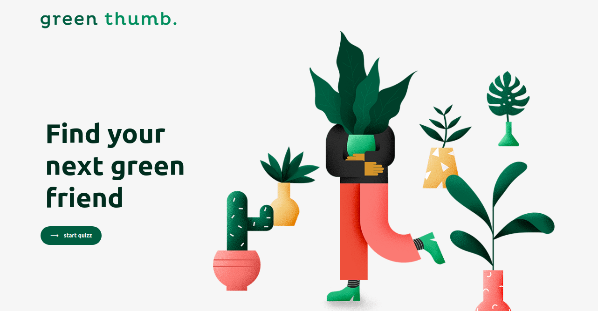

This project was bootstrapped with [Create React App](https://github.com/facebook/create-react-app).

# Red Venture Front End Challenge
Developed/designed using React JS.

## Getting Started:
For you run it, you need to install node.js, npm or yarn.
The versions used to develope this application was:
<br>
```sh
node v11.14.0
yarn v1.17
npm v3.10.10
```
<br>

## How to use
1. Clone/Download the repo.
  ```sh
git clone https://github.com/rodrigodan/red-venture-front-end-challenge.git
```
2. Run  ``` npm install ``` or ``` yarn install ``` to install all the dependencies
3. Run ```npm start``` or ```yarn start``` to spin the up the local dev server port 3000.
4. To access the application opened the browser and type: http://localhost:3000


## About the application:
This page follows the concept of single page application, where the page is divided into components that are updated in according to the user interaction.
Those components are responsible for generating every element that compose the page.


## Initial Page:

